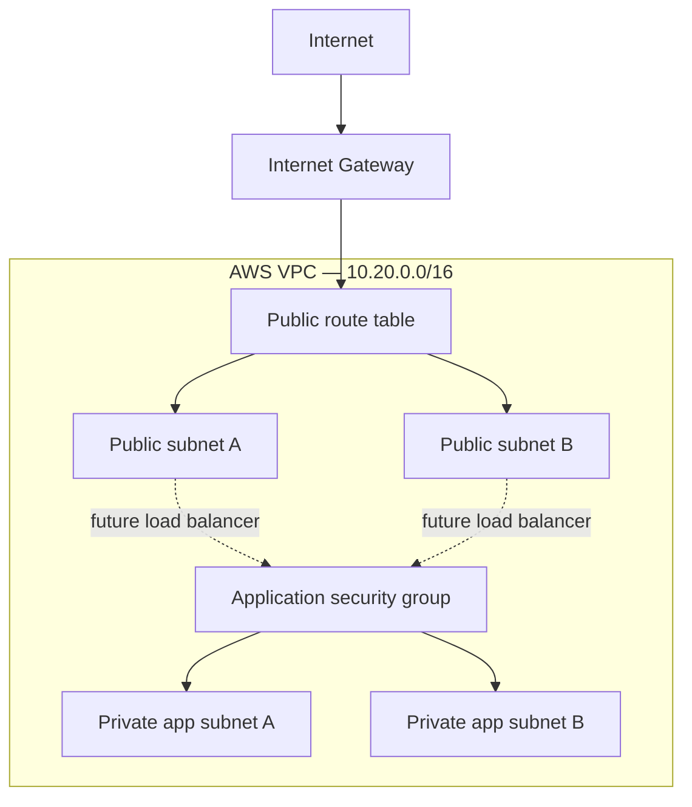
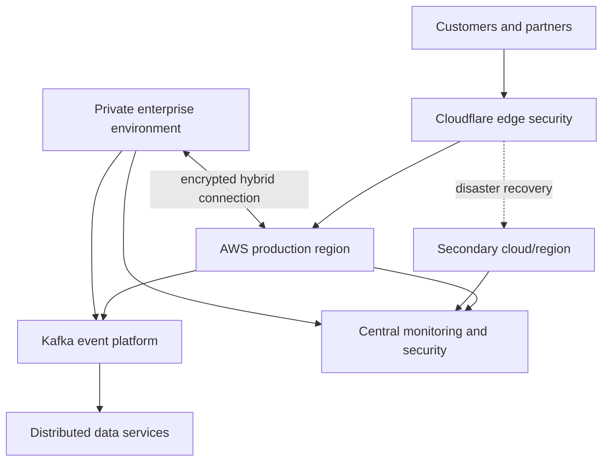

# Architecture

## Portfolio implementation: Milestone 1

The initial implementation establishes network segmentation without provisioning hourly billed compute or networking services. Private subnets intentionally have no default internet route during this milestone.

## Enterprise target state

The enterprise target is a future-state design. Its vendor choices, capacity, recovery topology, and security controls will be justified through architecture decision records rather than treated as automatically necessary.

## Trust boundaries

- Public edge: untrusted customer and partner traffic
- Public AWS tier: load-balancing endpoints only
- Private application tier: no direct inbound internet access
- Data tier: reachable only by explicitly authorized application identities
- Management plane: authenticated administrative access with MFA and auditable actions
- Hybrid boundary: encrypted, authenticated communication between environments

## Failure domains to test

- Individual application process
- Individual compute instance or container
- Availability Zone
- Incorrect route or security-group rule
- Failed deployment
- Message consumer backlog
- Primary application environment
